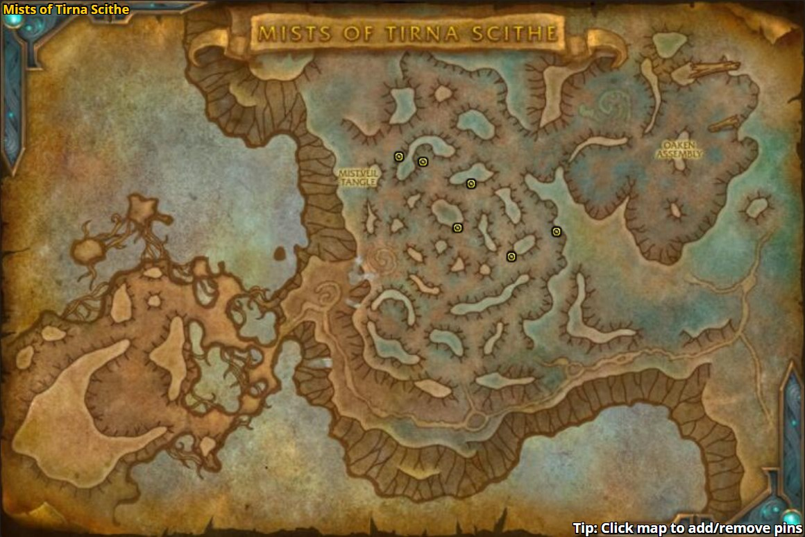

---
data:
  boss: '[Mistcaller](https://www.wowhead.com/npc=170217/mistcaller)'
difficulty:
  very_easy:
    style: 'color: lightgreen;'
    name: Very Easy
  easy:
    style: 'color: green;'
    name: Easy
  moderate:
    style: 'color: yellow;'
    name: Moderate
  hard:
    style: 'color: red;'
    name: Hard
  very_hard:
    style: 'color: #da0000;'
    name: Very Hard
requirement: Find Mistcaller's 6 toys in the Mists of Tirna Scithe on Mythic difficulty.
title: '[Someone Could Trip on These!](https://www.wowhead.com/achievement=14291/someone-could-trip-on-these)'
type: Personal
zone: '[Mists of Tirna Scithe](https://www.wowhead.com/zone=13334)'
---

# {{ title }}

_{{ requirement }}_

> - Boss: {{ data.boss }}
> - Difficulty: **{{ difficulty.very_easy.name }}**
> - Type: **{{ type }}**
> - Zone: {{ zone }}

## Details

- The maze prior to {{ data.boss }} contains `6` assorted toys, each at a specific location.
- These toys are difficult to spot and are typically hidden from plain view.
- The toys can be targeted and marked with raid markers to make them easier to spot.
- Per [denea@wowhead](https://www.wowhead.com/achievement=14291/someone-could-trip-on-these#comments:id=3259219) these are the locations:

## Strategy

1. Move through the maze as normal.
2. Kill {{ data.boss }}. This will close all gated doorways within the maze allowing free movement.
3. Traverse around the maze to find and interact with all `6` toys.
